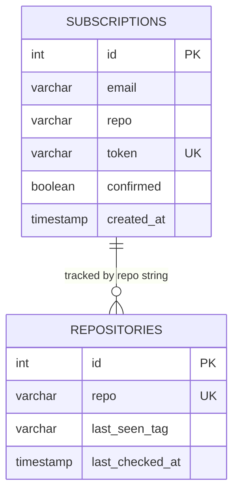

# ADR-003: Доступ до бази даних через sqlx замість ORM

**Статус:** Прийнято

**Дата:** 2026-05-08

**Автор:** Yurii Levchenko

## Контекст

Проєкт використовує PostgreSQL для зберігання:

- **Subscriptions** — підписки користувачів (email, repo, token, confirmed)
- **Repositories** — стан останнього побаченого релізу для кожного активного репо

Схема проста: 2 таблиці, без складних relations, без soft-delete, без поліморфних звʼязків.

Я приходжу з Django ORM-бекграунду — там ORM приховує SQL, що зручно але робить debug непрозорим. У Go є кілька різних рівнів абстракції роботи з БД, треба обрати оптимальний для цього обʼєму.

Додатковий контекст: завдання вимагає міграцій, які запускаються на старті сервісу. Незалежно від вибору ORM/не-ORM, SQL-міграції доведеться писати вручну (через `golang-migrate`).

## Розглянуті варіанти

### 1. GORM (повноцінний ORM)
- **Плюси:** Auto-migration, relations, hooks, schema generation, Active Record-подібний API. Знайомий патерн для Django-розробника.
- **Мінуси:** Прихований SQL — складно діагностувати продуктивність; ризик N+1 проблем; тяжкий рантайм; magic, який треба знати окремо. Для двох таблиць — overkill.

### 2. sqlx (тонкий wrapper над database/sql)
- **Плюси:** Прозорий SQL — пишеш самостійно і знаєш, що виконується. Mapping результатів у struct через теги `db:"column"`. Невеликий overhead над stdlib. Легко моніторити slow queries. Краще підходить для мого випадку з всього двома таблицями.
- **Мінуси:** Більше manual work — кожен CRUD-метод треба написати самому.

### 3. database/sql (stdlib raw)
- **Плюси:** Нуль зовнішніх залежностей.
- **Мінуси:** Без struct mapping — треба руками писати `rows.Scan(&id, &email, ...)` для кожного запиту. Надто багато boilerplate.

## Прийняте рішення

Обрано **sqlx**.

Ключове міркування: при простій схемі (2 таблиці, прямі queries без JOINів) переваги ORM не переважують втрату прозорості. sqlx дає 95% зручності GORM (struct mapping) при меншій складності реалізації.

Міграції — окремо, через `golang-migrate` із SQL-файлами в `/migrations`.

## Схема бази даних

Зв'язок між таблицями — логічний (через поле `repo` як string-key), не через foreign key. Це навмисно: `repositories` — це state-таблиця сканера, її life cycle не привʼязаний до конкретної підписки.

Унікальні обмеження:
- `subscriptions(email, repo)` — не можна підписатися двічі
- `subscriptions(token)` — токен унікальний для confirm/unsubscribe URLs
- `repositories(repo)` — один state-рядок на репо

## Наслідки

### Позитивні
- **Прозорий SQL:** будь-який запит можна скопіювати і виконати в `psql` або pgAdmin
- **Контроль продуктивності:** N+1 проблеми неможливі за неуважності — вони видно в коді одразу
- **Легке тестування:** репозиторій — тонкий шар; інтеграційні тести легко писати з testcontainers (TODO)
- **Знайомі патерни з database/sql:** перенос знань на інші Go-проєкти

### Негативні
- **Більше manual work:** кожен новий CRUD = новий метод репозиторію. Прийнятно для проєкту такого невеликого розміру але не для масштабування.
- **Auto-migrations недоступні:** треба писати SQL вручну. Проте можна через `golang-migrate` із пронумерованими `*.up.sql` / `*.down.sql` файлами