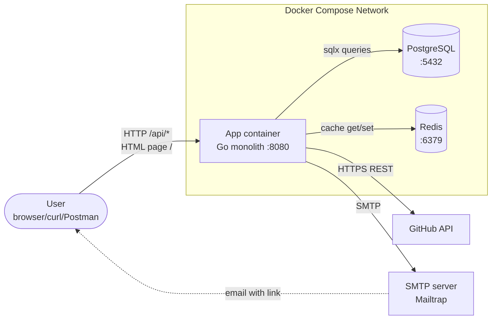
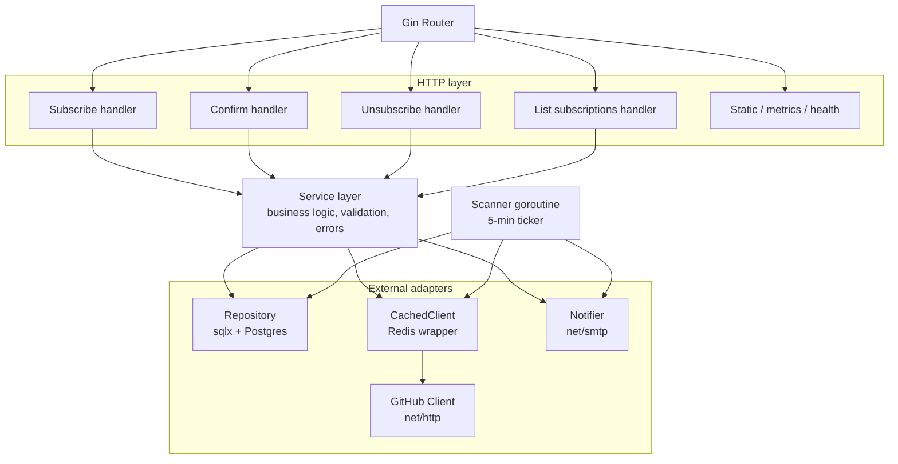
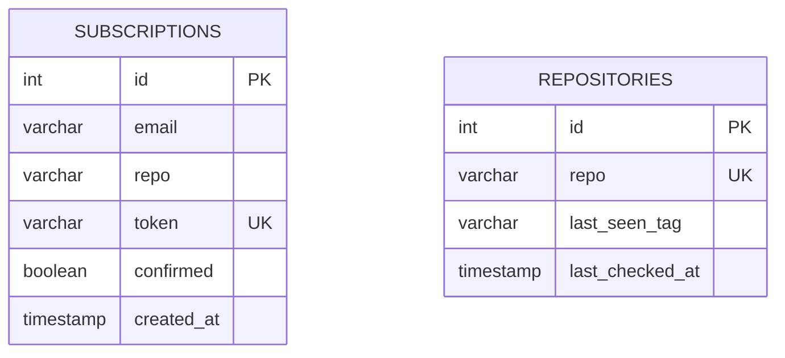
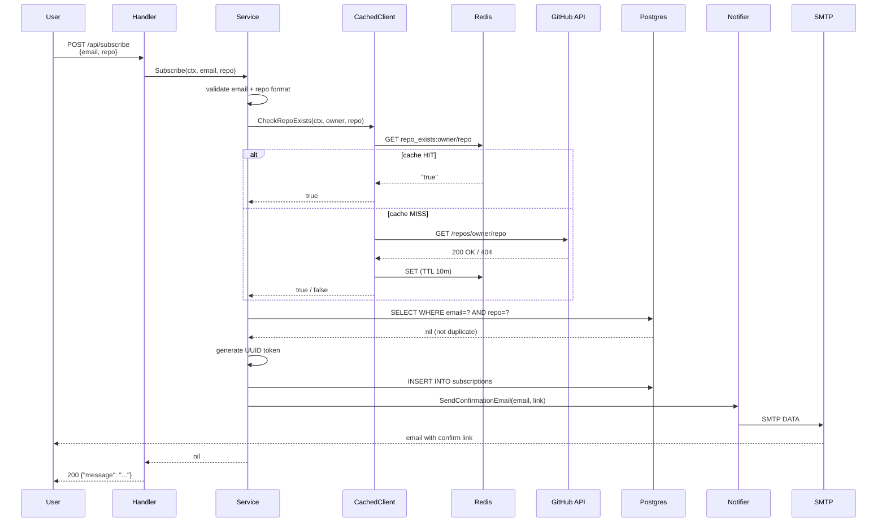
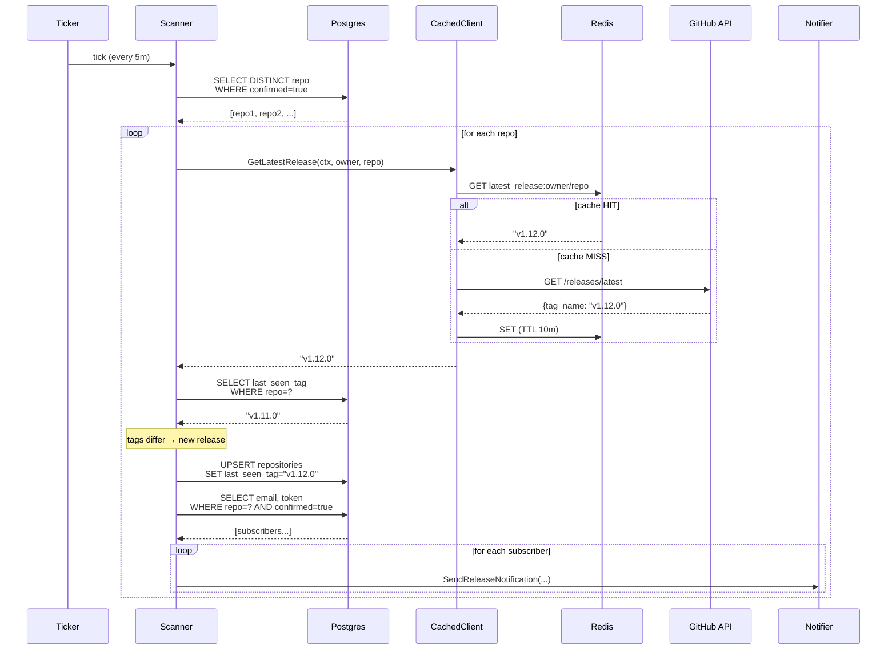

# System Design: GitHub Release Notification API

Сервіс, який дозволяє користувачам підписатися на email-сповіщення про нові релізи GitHub-репозиторіїв. Реалізований як моноліт на Go з трьома відповідальностями в одному процесі: HTTP API, фоновий сканер релізів, email-надсилач.

> Архітектурні рішення задокументовані в [/system-design/ADR](./ADR). У цьому документі — загальна картина системи: вимоги, навантаження, компоненти, потоки, масштабування.

---

## 1. Вимоги системи

### Функціональні вимоги

- Користувач може підписатися на сповіщення про релізи GitHub-репозиторію (формат `owner/repo`)
- При підписці надсилається email-лист з посиланням для підтвердження (double opt-in)
- Користувач може підтвердити підписку через одноразовий токен у листі
- Користувач може відписатись через токен (без логіну)
- Користувач може побачити список своїх активних (підтверджених) підписок за email-ом
- Сервіс періодично перевіряє GitHub на нові релізи для всіх підтверджених підписок
- При виявленні нового релізу — надсилає email усім підписникам цього репо
- Сервіс перевіряє існування репо на GitHub при підписці та повертає 404 для неіснуючих

### Нефункціональні вимоги

Проєкт навчальний, працює як single-instance в docker-compose. Жорстких SLA немає. Нижче — характеристики, які реалізовано на сьогодні, і цілі, до яких архітектура готова рухатись.

**Реалізовано:**
- **Запуск:** `docker-compose up --build` піднімає всю систему за <30s
- **Persistent state:** Postgres зберігає підписки і `last_seen_tag` сканера; рестарт app не втрачає даних
- **Безпека:** опційна API-key автентифікація на `/api/*`; UUID v4 токени (122 біти ентропії — неможливо вгадати); SQL-параметризація через sqlx (anti-injection); `ReadHeaderTimeout: 10s` (anti-Slowloris)
- **Спостережуваність:** Prometheus `/metrics` з кастомними counters і histograms; логи у stdout (наразі plaintext через stdlib `log`)
- **Graceful shutdown:** SIGTERM скасовує сканер і дає 5s HTTP-серверу на завершення in-flight запитів

**Цілі (готовність архітектури, не виміряно):**
- **Затримка API:** subscribe залежить від GitHub API (~200-500ms cache miss, <50ms cache hit); list/unsubscribe не роблять зовнішніх викликів — мають бути <50ms
- **Масштабованість:** оцінка — до 10K активних підписників і 1K унікальних репо без зміни архітектури (не load-tested)

**Відомі gaps (TODO для production):**
- **Email worker pool:** наразі сканер надсилає листи синхронно в одному циклі. При 1K+ підписників на один популярний реліз цикл блокується на хвилини (1K × ~100ms = ~100s) і пропускає наступний tick. Потрібен пул горутин (10-50 одночасних SMTP-з'єднань) із семафором; це знімає блокування і дає реалістичну пропускну здатність на пікових релізах
- **At-least-once email delivery:** наразі best-effort. Якщо Notifier падає між `INSERT subscription` і `SMTP send` — лист не йде. Потрібен outbox-pattern (persisted queue в БД + retry-worker)
- **Структуроване логування:** перехід на `slog` або `zap` із JSON-output для агрегації в Datadog/Grafana
- **HTTPS:** треба reverse proxy (Caddy/nginx) перед app у проді
- **Distributed lock на сканер:** для multi-instance розгортання (зараз 1 інстанс — race condition неможливий)
- **Моніторинг і алертинг:** немає (Prometheus метрики експонуються, але нікуди не скрейпляться)
- **Надсилання на email:** надсилати листи не на Mailtrap а на рельний inbox імейл-провайдера

### Обмеження

- **Моноліт:** усі три ролі (API, Scanner, Notifier) живуть в одному процесі
- **GitHub API rate limits:** 60 req/h без токена, 5000 з токеном
- **SMTP-провайдер:** покищо надсилання листів лише на Mailtrap (sandbox) для розробки
- **Бюджет інфраструктури:** мінімальний — 3 контейнери (app, postgres, redis)

---

## 2. Оцінка навантаження

### Користувачі та трафік

| Метрика | Очікувано | Пік |
|---|---|---|
| Активні підписники | ~5K | 10K |
| Підписок на користувача | 2-5 | 20 |
| Унікальні репо для трекінгу | ~1K | 5K |
| Subscribe-запити (POST /api/subscribe) | 0.1 RPS | 5 RPS |
| List-запити (GET /api/subscriptions) | 0.5 RPS | 10 RPS |
| Релізів за день (на всіх трекнутих репо) | ~50 | 200 |
| Email-сповіщень за день | ~200 | 5K (в день масового релізу) |

> Цифри обрано виходячи з відомих лімітів: GitHub token дає 5000 req/h, що з 10-хвилинним кешем покриває 1K унікальних репо при 5-хвилинному циклі сканера. Postgres і Redis на single instance тримають тисячі QPS — наш пік 10 RPS на цих шарах не помітний. Реальне обмеження — пропускна здатність email-надсилання при бурстах (див. TODO нижче).

### Розмір даних

| Запис | Розмір | На 10K юзерів |
|---|---|---|
| `subscriptions` row | ~150 байт (email + repo + UUID + timestamps) | ~1.5 МБ |
| `repositories` row | ~80 байт (repo + last_seen_tag + timestamp) | ~80 КБ для 1K репо |
| Redis cache entry (`repo_exists`, `latest_release`) | ~50 байт | ~250 КБ для 5K ключів |
| **Загальний обсяг БД після року роботи** | — | **< 50 МБ** |

База мала — будь-який сучасний Postgres-інстанс впорається. Bottleneck — не БД.

### Bandwidth

| Напрямок | Розмір | Оцінка |
|---|---|---|
| Incoming HTTP requests | ~500 байт на запит | <1 KB/s |
| Outgoing GitHub API requests | ~200 байт запит / ~2 КБ відповідь | ~5 KB/s в середньому, мало завдяки кешу |
| Outgoing SMTP (release email) | ~1 КБ на лист | бурстами при релізах, 0 між ними |
| Outgoing SMTP (confirmation) | ~1 КБ на лист | <1 KB/s |

Мережа — теж не Bottleneck.

### Bottleneck

**GitHub API rate limit.** На 1000 унікальних репо і 5-хвилинному циклі сканера без кешу = 12000 req/h, що в 2.4× перевищує ліміт навіть з токеном. Тому Redis-кеш із 10-хвилинним TTL (ADR-005) — критичний компонент, а не nice-to-have.

---

## 3. High-Level архітектура



### Внутрішня структура моноліту



---

## 4. Детальний дизайн компонентів

### 4.1 API Service (Gin)

**Відповідальність:**
- Приймати HTTP-запити, парсити JSON-body і URL-параметри
- Валідувати вхідні дані (email format, required fields)
- Викликати Service-шар і мапати business errors на HTTP-статуси
- Сервити статичну HTML-сторінку на `/` для browser-based підписки
- Експортувати Prometheus-метрики на `/metrics`

**Endpoints:**
```
GET    /                            HTML subscription page
GET    /health                      health probe → {"status":"ok"}
GET    /metrics                     Prometheus metrics
POST   /api/subscribe               body: {"email":"...","repo":"owner/repo"}
GET    /api/confirm/:token          confirm via UUID token
GET    /api/unsubscribe/:token      unsubscribe via UUID token
GET    /api/subscriptions?email=..  list active subscriptions
```

**Обробка помилок** (мапінг на HTTP-статуси через `errors.Is`):
- `ErrInvalidEmail`, `ErrInvalidRepoFormat` → 400
- `ErrRepoNotFound` → 404
- `ErrAlreadySubscribed` → 409
- `ErrTokenNotFound` → 404
- інше → 500

**Middleware-стек:** logger → recovery → metrics-collector → optional API-key auth → handler.

Middleware — це функції, які обгортають handler і виконуються до/після нього. Порядок важливий: пройти через увесь стек запит має згори донизу, відповідь — у зворотному напрямку. Наш порядок:

- **logger** (Gin) — записує метод, шлях, статус, тривалість кожного запиту в stdout. Стоїть першим, щоб логувати все, включно з тими запитами, які впадуть далі по стеку
- **recovery** (Gin) — ловить `panic()` і конвертує в HTTP 500 замість краху всього процесу. Без нього один баг в одному handler-і вбиває весь сервер
- **metrics-collector** — записує `http_requests_total` і `http_request_duration_seconds` для Prometheus (див. секцію 4.7)
- **API-key auth** (опційний, тільки якщо `API_KEY` env-змінна задана) — перевіряє заголовок `X-API-Key`. Якщо ключа немає або він невірний — 401/403, handler не виконується
- **handler** — фінальна точка, твій бізнес-код

### 4.2 Service layer (бізнес-логіка)

**Відповідальність:**
- Валідація email через regex
- Парсинг `owner/repo` формату
- Координація викликів між Repository, GitHub Client, Notifier
- Генерація UUID токенів
- Визначення доменних помилок (`ErrXxx`)

**Ключові методи:**
```go
Subscribe(ctx, email, repo) error
Confirm(token) error
Unsubscribe(token) error
GetSubscriptions(email) ([]Subscription, error)
```

`Subscribe` приймає `context.Context` для прокидання у GitHub-клієнт (ADR-006).

### 4.3 Repository layer (Postgres + sqlx)

**Відповідальність:** усі SQL-запити до БД через `sqlx`.

**Дві таблиці:**



**Ключові обмеження:**
- `UNIQUE(email, repo)` у `subscriptions` — заборона дублікатів
- `UNIQUE(token)` — токен як гарантовано одиничний confirm/unsubscribe URL
- `UNIQUE(repo)` у `repositories` — один state-рядок на репо

**Запити:**
- Subscriptions: Create / GetByToken / GetByEmailAndRepo / Confirm / Delete / GetActiveByEmail / GetActiveRepos / GetSubscribersByRepo
- Repositories: GetTracking / UpsertTracking (UPSERT через `ON CONFLICT DO UPDATE`)

**Міграції:** `golang-migrate` запускається на старті застосунку, читає `migrations/*.up.sql` і виконує нові.

### 4.4 GitHub Client (із Redis-обгорткою)

**Caching Strategy** (двошарова через інтерфейс — див. ADR-005):

- **L1 (Redis):** TTL 10 хв для `repo_exists:owner/repo` і `latest_release:owner/repo`
- **L2 (none, raw call to GitHub API)** — використовується при cache miss або коли Redis недоступний
- **Fallback:** якщо Redis відключений на старті — `main.go` підставляє raw `Client` без кешу і логує warning

**Rate Limit Handling:**

```go
// Експоненціальний backoff на 429
maxRetries := 3
for i := 0; i < maxRetries; i++ {
    resp, err := c.httpClient.Do(req)
    if resp.StatusCode != http.StatusTooManyRequests {
        return resp, nil
    }
    backoff := time.Duration(2<<i) * time.Second  // 2s, 4s, 8s
    time.Sleep(backoff)
}
```

**Опційний токен:** якщо `GITHUB_TOKEN` встановлено — додається у заголовок `Authorization: Bearer ...`, ліміт зростає з 60 до 5000 req/h.

### 4.5 Scanner (background goroutine)

**Відповідальність:** періодичний обхід усіх активних репо і виявлення нових релізів.

**Запуск:** з `main.go` через `go releaseScanner.Start(ctx)`. `ctx` — головний контекст застосунку, скасовується при SIGTERM/SIGINT.

**Цикл:**
```go
ticker := time.NewTicker(5 * time.Minute)
for {
    select {
    case <-ctx.Done():
        return // graceful shutdown
    case <-ticker.C:
        scan(ctx)
    }
}
```

Кожен `scan(ctx)` циклу:
1. `repo.GetActiveRepos()` → список унікальних `owner/repo` із підтверджених підписок
2. Для кожного: `github.GetLatestRelease(ctx, owner, repo)` (через кеш)
3. Порівняти з `repositories.last_seen_tag` у БД
4. Якщо тег новий — `repo.UpsertRepoTracking(repo, tag)` + надіслати email кожному підписнику

**Масштабування:** на 1 інстансі. Кілька реплік без додаткової координації призвели б до дублікатних повідомлень — потрібен distributed lock (Redis або Postgres advisory lock) перед майбутнім multi-instance розгортанням.

### 4.6 Notifier (SMTP)

**Відповідальність:** надсилання email через стандартний `net/smtp`.

**Два типи листів:**
- `SendConfirmationEmail(to, confirmURL)` — після підписки
- `SendReleaseNotification(to, repo, tag, unsubscribeURL)` — при детекції нового релізу

**Конфігурація через env:** `SMTP_HOST`, `SMTP_PORT`, `SMTP_USER`, `SMTP_PASS`, `SMTP_FROM`.

**Дев-середовище:** Mailtrap sandbox (`sandbox.smtp.mailtrap.io:587`) — листи "приходять" у фейкову інбоксю замість реальних адрес. Безпечно для тестів.

**Production-готовність:** код Notifier — це справжній SMTP, тому переключення на SES/SendGrid/Mailgun у проді — лише питання env-змінних, без зміни коду.

### 4.7 Observability (Prometheus + structured logs)

**Метрики на `/metrics`:**
- HTTP: `http_requests_total{method,path,status}`, `http_request_duration_seconds`
- Бізнес: `subscriptions_created_total`, `subscriptions_confirmed_total`, `unsubscribes_total`
- Сканер: `scanner_runs_total`, `releases_detected_total`, `notifications_sent_total`
- GitHub: `github_api_calls_total{endpoint, cache="hit|miss"}` — пряма видимість ефективності кешу

**Логи:** stdout структурований (через `log` stdlib + Gin debug logger). У продакшні треба переходити на `slog` або `zap` із JSON-output для агрегації.

---

## 5. Ключові потоки

### 5.1 Subscribe flow



### 5.2 Scanner cycle (every 5 min)



---

## 6. Масштабування

Система проєктована під ~10K підписників. Що зміниться при 10×, 100× і 1000×:

| Масштаб | Що ламається першим | Як адаптувати |
|---|---|---|
| **100K підписників** | Email throughput у синхронному циклі сканера (один лист = ~100ms через SMTP × 1000 підписників на популярний реліз = 100s) | Винести email-надсилання у worker-pool горутин, або в окрему чергу повідомлень |
| **1M підписників, 50K репо** | GitHub API rate limit; БД-навантаження на сканер-запит | Розділити репо між кількома GitHub-токенами; partitioning таблиці `subscriptions` за hash(email); replica для читань |
| **10M підписників** | Неминуче розщеплення на сервіси | Винести Scanner у окремий сервіс із distributed lock; винести Notifier за чергою (SQS/RabbitMQ); Postgres → керована БД із read replicas |

**Поточна архітектура має чіткі точки для горизонтального масштабування**, оскільки всі stateful-компоненти (Postgres, Redis) уже зовнішні відносно app. Скейлити можна спочатку вертикально, потім — реплікація app із distributed lock на сканер.

---

## 7. Failure modes

| Падає | Що бачить юзер | Як деградує |
|---|---|---|
| **PostgreSQL** | API повертає 500 на всі endpoints | Сервіс непрацездатний — це critical dependency |
| **Redis** | API працює як завжди | Кеш missing → прямі виклики GitHub → ризик rate limit при високому навантаженні. Логується warning |
| **GitHub API** (5xx або downtime) | Subscribe може провалитися (404 на CheckRepoExists інтерпретується як неіснуюче репо — TODO: розрізнити 5xx vs 404) | Сканер логує помилку і йде далі; на наступному циклі спробує знову |
| **SMTP-провайдер** | Subscribe-запит повертає 500 (не може надіслати confirmation) | Сканер логує помилку, реліз-сповіщення не йдуть; на наступному циклі повторної спроби немає (TODO: queue з retry) |
| **GitHub rate limit (429)** | Subscribe може повільно відповісти (експ. backoff) або провалитися | Експ. backoff 2s/4s/8s, потім помилка |
| **Контейнер app падає** | API недоступний на час рестарту | Docker `restart: on-failure` піднімає за секунди; підписки не втрачаються, бо стан у БД |

**Що поки не покрито**
- Outbox-pattern для email — немає гарантії доставки при падінні Notifier-а між INSERT subscription і SendEmail
- Idempotency на subscribe — можна випадково створити дублікат, якщо клієнт зробить retry. Але через `UNIQUE(email, repo)` на рівні БД не так критично
- Distributed lock на сканер — multi-instance розгортання спричинить дублікати

---

## 8. Безпека

| Surface | Захист | Стан |
|---|---|---|
| API endpoints | Опційний `X-API-Key` header (через `API_KEY` env) | Реалізовано (middleware) |
| Subscription token | UUID v4 (122 біти ентропії, неможливий брутфорс) | Реалізовано |
| SQL injection | sqlx параметризовані запити (`$1, $2`) | Реалізовано |
| Email validation | Regex + Gin's binding `email` validator | Реалізовано |
| Slowloris attack | `ReadHeaderTimeout: 10s` на http.Server | Реалізовано (виправлено в HW#1) |
| HTTPS | Поки out of scope — рекомендовано reverse proxy (Caddy/nginx) у проді | Не реалізовано |
| Secret management | `.env` файл, у `.gitignore`; `.env.example` для шаблону | Реалізовано |
| Rate limiting (per-IP) | Не реалізовано | TODO для проду |

---

## 9. Технологічний стек

| Шар | Технологія | Чому | ADR |
|---|---|---|---|
| Мова | Go 1.26 | Статика, goroutines, alignment з Genesis | [001](./ADR/001-go-with-gin-as-thin-http-framework.md) |
| HTTP | Gin | Тонкий router з валідацією | [001](./ADR/001-go-with-gin-as-thin-http-framework.md) |
| Архітектура | Layered monolith | Чіткий поділ, тестованість | [002](./ADR/002-monolith-with-layered-architecture.md) |
| ORM | sqlx (raw SQL) | Прозорість, контроль | [003](./ADR/003-sqlx-instead-of-orm.md) |
| БД | PostgreSQL 16 | Надійність, зрілість | [003](./ADR/003-sqlx-instead-of-orm.md) |
| Міграції | golang-migrate | SQL-файли, runs on startup | [003](./ADR/003-sqlx-instead-of-orm.md) |
| Шедулер | In-process goroutine | Без зовнішньої інфраструктури | [004](./ADR/004-goroutine-scanner.md) |
| Кеш | Redis 7 | TTL з коробки, persistence | [005](./ADR/005-redis-caching-for-github-api.md) |
| Тестування | Go testing + interfaces з моками | Без зовнішніх залежностей у тестах | [006](./ADR/006-context-propagation-through-call-chain.md) |
| Метрики | Prometheus client_golang | Стандарт індустрії | — |
| Контейнеризація | Docker + docker-compose | Reproducible setup | — |
| CI | GitHub Actions + golangci-lint | Стандарт для GitHub-проєктів | — |

---

## 10. Що я покрищу далі

- **Outbox-pattern для email** — гарантована доставка через persisted queue в БД
- **Distributed lock на сканер** через Redis SETNX або Postgres advisory lock — для multi-instance розгортання
- **Структуроване логування через `slog`** замість stdlib `log` — JSON-output для агрегації в Datadog/Grafana
- **OpenTelemetry tracing** — використати наявне context propagation, додати spans у GitHub-клієнт і SMTP
- **Integration-тести з testcontainers** — реальні Postgres + Redis у тестах
- **gRPC API** як альтернатива REST (бонус задачі)
- **Rate limiting per IP** — захист від abuse на subscribe
- **HTML email templates** — наразі plain text
