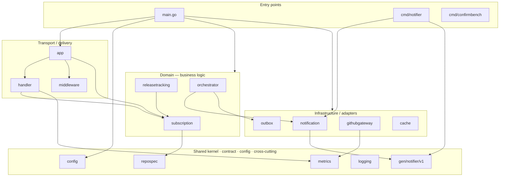

# Architecture — layers & dependency rules

Цей документ описує **пошарову структуру** застосунку і **правила залежностей** між
шарами (HW11). Він доповнює [`system-design/README.md`](./README.md), який дає
компонентний і потоковий вигляд (хто з ким говорить у рантаймі); тут натомість —
**статична залежність між пакетами** (хто кого імпортує) і чому саме так.

> ⭐ Правила нижче — не лише на словах: вони закодовані як **виконувані тести** в
> [`internal/architecture/arch_test.go`](../internal/architecture/arch_test.go) і падають
> у CI, якщо архітектуру порушено (напр. домен почав імпортувати транспорт).
>
> 🎨 **Намальована (редагована) версія** — [`architecture.excalidraw`](./architecture.excalidraw):
> відкрий на [excalidraw.com](https://excalidraw.com) → **Open** → вибери файл (це нативні
> фігури Excalidraw, не картинка — можна вільно рухати й правити).

---

## 1. Шари

Застосунок — **модульний моноліт** (ADR-002) + окремий мікросервіс `notifier`. Пакети
згруповані в шари; залежності мають вказувати **всередину** (до ядра), ніколи назовні.

| Шар | Пакети | Відповідальність | Може залежати від |
|---|---|---|---|
| **Entry points** | `main.go` (моноліт), `cmd/notifier`, `cmd/confirmbench` | Композиція залежностей (wiring), запуск процесів | будь-що (це «корінь») |
| **Transport / delivery** | `internal/app`, `internal/handler`, `internal/middleware` | HTTP: парсинг запитів, маппінг доменних помилок на статуси, роутинг, middleware | Domain, cross-cutting |
| **Domain (бізнес-логіка)** | `internal/subscription`, `internal/releasetracking`, `internal/orchestrator` | Правила, валідація, оркестрація саги — **серце системи** | Shared kernel, інтерфейси інфраструктури |
| **Infrastructure / adapters** | `internal/githubgateway`, `internal/notification`, `internal/outbox`, `internal/cache` | Реалізації зовнішніх взаємодій: GitHub HTTP, брокер/gRPC, БД-outbox, Redis | Shared kernel, contract |
| **Shared kernel + contract + config** | `internal/repospec`, `gen/notifier/v1`, `internal/config` | Value object `RepoSpec`; згенерований gRPC-контракт; конфіг | нічого внутрішнього (листя) |
| **Cross-cutting** | `internal/logging`, `internal/metrics` | Логування (slog), Prometheus-метрики | — |

## 2. Діаграма залежностей

Стрілка = «імпортує». Напрямок — згори вниз (до ядра). Порушення напрямку (стрілка вгору)
= порушення архітектури.



## 3. Правила залежностей (і тести, що їх стережуть)

| # | Правило | Чому | Тест |
|---|---|---|---|
| A | Моноліт **не** імпортує `net/smtp` (навіть транзитивно) | SMTP — приватна справа `notifier` (HW7); моноліт не має знати про пошту | `TestArch_MonolithHasNoSMTP` |
| B | Domain **не** залежить від Transport (`handler`/`app`/`middleware`) | Залежності вказують усередину; бізнес-логіка не знає про HTTP-доставку | `TestArch_DomainDoesNotImportTransport` |
| C | Domain **не** імпортує `net/http` напряму | Домен транспортно-нейтральний; маппінг статусів — лише в `handler.translateError` | `TestArch_DomainIsTransportNeutral` |
| D | `repospec` (shared kernel) не імпортує нічого внутрішнього | Ядро-листя: будь-який шар може ним користуватись без циклів | `TestArch_SharedKernelIsLeaf` |
| E | `handler` не імпортує інфраструктуру напряму | Транспорт ходить через `subscription.Service`, а не в адаптери навпростець | `TestArch_HandlerGoesThroughService` |

## 4. Як запустити тести

```bash
go test ./internal/architecture/...
```

Тести шелл-аутять `go list` (щоб читати той самий граф імпортів, що й `go build`), тож не
тягнуть зовнішніх залежностей. Вони проганяються у звичайному `go test ./...` (unit-CI).

## 5. Чесні нюанси (де архітектура не «ідеально чиста»)

- **`releasetracking → subscription`.** Сканер читає підписників через **фасад** підписки
  (`SubscriberSource` + ACL-DTO `Subscriber`), тож між доменами є compile-time залежність.
  Це свідомо: `subscription` — «ядерніший» домен, а сканер бере лише його публічний фасад,
  не БД-стор. Тому правила «домени не залежать один від одного» тут **немає** — воно було б
  неправдою.
- **`orchestrator → notification`/`outbox`.** Оркестратор саги імпортує `notification` (заради
  DTO-контракту команд `ConfirmationRequest` + routing-констант) і `outbox` (стор). Це домен,
  що спирається на інфраструктурні пакети напряму — прийнятно для модульного моноліту цього
  масштабу (не вводимо окремий шар портів заради двох типів).
- **Entry points імпортують усе** — це нормально: `main.go` — місце композиції, воно й має
  бачити всі шари, щоб їх з'єднати.
